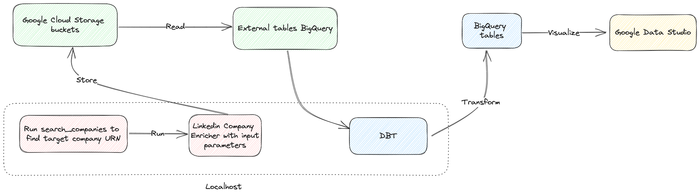
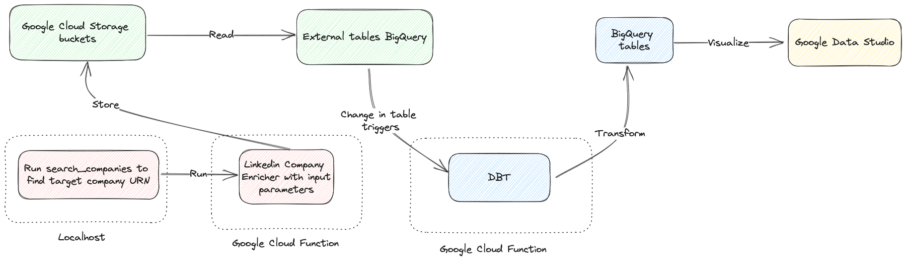

# Linkedin Company Data Enricher

> This project attempts to infer the quality of an organization's culture based on the employees rotation, i.e. is the time an employee stays at a company an indicator of how good the company is to work for? For this, I used an Open Source Linkedin scraper to retrieve employee's portfolio data and applied data transformations to calculate the metrics that would help me determine the quality of a given company's culture. 
>
> This project will help me gain insight into the companies I'm interested in applying for and therefore make a more a informed decision on which ones to prioritise.
>
> On the development of this project, I've had the chance to contribute to an Open Source library, perform analysis and prove assumptions via hypothesis testing


## Motivation
One of the biggest uncertainties when looking for a new role is finding out if the company you are applying for has a good Organizational Culture. By Organizational Culture I mean the set of values, beliefs, attitudes, systems, and rules that outline and influence employee behavior within the organization.

Personally, on my job hunting process there are three types of information that I retrieve in order to determine if a company is worth applying for:
1. Does the role description fit my experience and expectations?
2. Do I like the company industry? Do I like the type of projects they do?
3. What is the overall reputation of the company? (I check on Glassdoor and other review places like Trustpilot/Google if they offer a product that can be reviewed)

However, I always found that there was a missing piece of information here. I wanted to know more about the Organization's culture. Most people try to find some cues about a company's culture based on how they have felt during an interview process. This is, they interpret the rapport they experienced with the interviewer/s and extrapolate it to the company. If I enjoyed the interview and the interviewer was really nice, then there is a good chance that my team and my manager will also be nice. However, the reality is that in one hour of interview we can't really know how it is to work there and we can't extrapolate this subjective experience to the whole of the company. Is there any other more objective way to find out about this? One thing we can do is to contact one of our future possible colleagues and ask them about it. However, there might be something else we can do...

From experience and from people I'm close with, people tend not to stay for long in a company if it has a bad culture (toxic environment, bad management, poor work/life balance...). This made me wonder, can I infer a company's culture based on how long do employees stay in the company and how long compared to the average they have stayed in previous companies?


## Observations
Note that even though employees rotation is a useful metric to better understand a company's culture, it might not be very reliable. There are a few reasons why:
- Older employees tend to be less prone to switch companies (can we prove this assumption?) which would skew the data. On the other hand, younger employees tend to do more job hopping (can we prove this assumption?)
- Employees might not change jobs because they can't find anything better on the market or the situation of the market is unstable to find another job
- Each role has different types of employee profile and behaviour. For instance, young software engineerings tend to stay in a company 2-3 years independently of the quality of the company (can we prove this assumption?)
- Most contractors stay for a defined lenght in the company. We can't tell if a role is full-time or contractor based on the information extracted from Linkedin.

There could be other reasons that I'm missing here, but I wanted to clarify that the results and conclusions here might not give an accurate representation of the culture of a company. However, it is an interesting metric to check and I was curious to perform this analysis, therefore the motivation of this project.


## Linkedin API
Linkedin is one of the largest, if not the largest job boards. It takes the role of a professional social network where people add their portfolio and build their network. Therefore, it is the logical place to search for our data.

Linkedin doesn't have a free open API, but thanks to Open Source we can find unofficial APIs like the one we are using here: https://github.com/tomquirk/linkedin-api. This comes with some drawbacks though: 
- The API is not official, so if too many requests are done, our Linkedin account could be banned. I'm using it only as a personal project so it shouldn't be a risk, but I'm creating a temporary account for the purpose of this project
- I can only extract employees experience data up to 3rd degree connections in my network on Linkedin. I would need to connect with many people with my dummy account in order to access more contacts, which is not feasible. One solution could be to use the 7 day Premium trial on my dummy account, but I haven't tested that yet
- The API only returns the last 5 job experiences, but that might be enough for our purposes


## Open Source collaboration
When I first thought about working on this side project, I created my MVP in order to do a first test and see if it would work. However, I realised that the API endpoint I needed to use wasn't working. This is because Linkedin recently implemented some changes in their API endpoint that broke the existing logic.

Therefore, I decided that this was a good opportunity to contribute to an open source community and I decided to take a look at the issue. After playing around, doing some reverse engineering with the endpoints that Linkedin calls (checking the "Networks" tab on the browser) and looking at discussions on a Github issue about the topic, I implemented my change, tested it and created a PR: https://github.com/tomquirk/linkedin-api/pull/332 which has already been merged.

Having fixed the issue, I was able to start with my project.


## Architecture and Logic



The logic to collect the data is as follows:
1. Run `search_companies(keywords = company_to_look)` in order to find the company's URN (ID) I want to analyse
2. Search for past and present employees with 
    - `search_people(current_company=[searched_company_urn], limit=limit)`
    - `search_people(past_companies=[searched_company_urn], limit=limit)`
5. For each employee URN, run `api.get_profile(urn_id = urn)` which will retrieve all employee's experience and education

This data is stored in a raw `employees_experience` and `employees_education` buckets in Google Cloud Storage which is later transformed to perform different analysis.

These experience and education files are consumed by an external BigQuery table.

Then, DBT core is triggered to transform the data in the tables needed for analysis. Queries are stored in `dbt_project.models/` folder, structured by layers as best practices of [DBT suggest](https://docs.getdbt.com/guides/best-practices/how-we-structure/1-guide-overview).

I used a virtual environment to keep packages and versions isolated from other work.

Why did I use Google Cloud Platform for this project? GCP has a really generous free tier for my personal project and I am already familiar with it since I use it at my actual job. However, I'd like to get familiar with AWS too since it is widely used in many companies. I don't think it will be a big challenge since tools can be picked up quickly if one has the basics and best practices of Data Architecture covered.

Note:
This is the first draft of what was supposed to be the architecture of the project:



I planned to run the script on a Cloud Function triggered from my local every time I had a new target company to analyse. However, Linkedin API returns a [CHALLENGE error](https://github.com/tomquirk/linkedin-api#i-keep-getting-a-challenge), which is a known issue and it is documented in the package repo, and I haven't had the chance to attempt to solve it yet.


## Metrics
As mentioned earlier, the main metric I wanted to take a look is: how long do employees stay in a target company and how long have they stayed in previous companies? I'm looking for a ratio between target and other companies.

Therefore the metric is calculated as:

```avg_ratio_months_in_target_company_vs_others = total months in target company / average months in previous companies```

I'll retrieve that metric per employee and then group by company.
In my final model I have these metrics:
- avg_ratio_months_in_target_company_vs_others
- avg_months_in_target_company
- avg_months_in_other_companies

How do I know what metric values are good? We take as benchmark an average of the top 5 and last 5 companies to work for extracted from different sources when looking for "Best companies to work for" in Google like [this one](https://www.greatplacetowork.co.uk/best-workplaces/2023). We use those values as a reference line and we compare target companies with them.

Notes:
- I've split calculations between two types of roles: Data/Software and others. This is because I'm applying for Data roles so I'm more interested in metrics regarding these types of roles and analysing them in isolation
- I'm only looking at past roles (not employees currently working at target company) because I want to analyse patients that left. This might skew the data though, since there might be "happy" employees that haven't left the company and I haven't taken them into account. They might be included in a follow up analysis
- Internships are excluded

## Proving assumptions

**Can we prove the assumption that software related roles tend to stay in a company 2-3 years independently of the culture of the company?**

Where `is_role_in_target_list` include any role with the keywords `analyst|engineer|baz|data|machine learning|developer|architect`.

We'll need to perform a T-test to check if the two populations have different means:
- Null hypothesis: The two populations have same mean
- Alternative hypothesis: The two populations have different means

Running a simple t-test:

```

import pandas as pd
from scipy import stats

df = pd.read_csv('extract_of_stg_employees_experience.csv')

group_a = list(df.query('is_role_in_target_list == False')['months_in_company'])
group_b = list(df.query('is_role_in_target_list == True')['months_in_company'])

stats.ttest_ind(group_a, group_b, equal_var = False)

```

We find out that `Ttest_indResult(statistic=0.39388361215871504, pvalue=0.6937392362849801)`
p-value is 0.69 so we can't really reject the null hypothesis and we can't say that the assumption is correct

**Do we see that publicly known good companies have higher metric score and bad companies have lower metric score?**

In this case we can create two groups: companies rated as "best companies to work for" and "worst companies to work for". Once we get these two groups, we perform another two sample t-test as previously and check our hypothesis. I haven't performed the calculations yet so I leave it as TO DO.

However, with the bare eye I noticed that companies on the "best companies to work for" list are on the top of the list when sorted by `avg_ratio_months_in_target_company_vs_others`. This data is public, but I've masked the names of the companies just in case:

|target_company_name             |avg_ratio_months_in_target_company_vs_others|
|--------------------------------|--------------------------------------------|
|Company in top best places to work for A|3.983398693                                 |
|Company in top best places to work for B|2.977727273                                 |
|Known company A                 |2.141715116                                 |
|Known company B                 |1.103                                       |
|Known company C                 |0.914285714                                 |
|Company with bad reputation A   |0.609                                       |


## Conclusions
I've developed this project out of personal interest in finding out if the quality of a company's culture can be infered from the employees rotation. We can say for the moment that the outcome is inconclusive, we need more data to properly observe patterns. As defined in the drawbacks, that was something more or less expected. There are a lot of factors that influence the decision of an employee to stay or leave a company. However, I still found it useful to ran this analysis since it gives me more data in order to evaluate the companies I am applying to.

This data might be also interesting for recruiters wanting to know more about a company and other candidates looking to get a better understanding of a company's culture.
